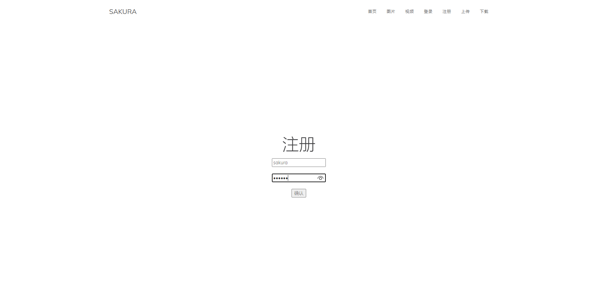
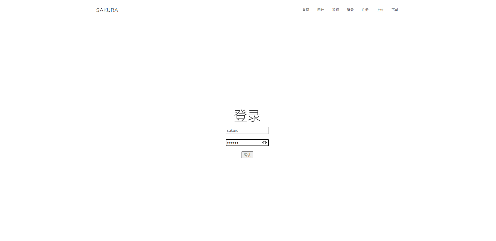
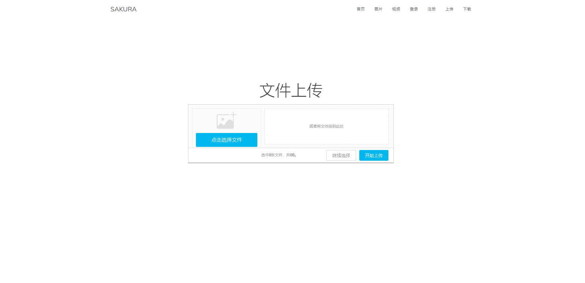
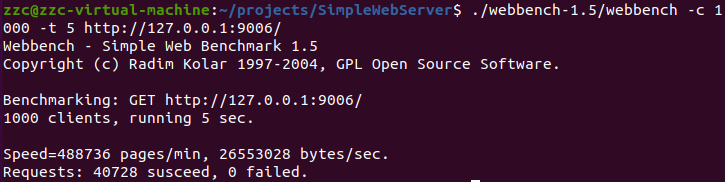

# SimpleWebServer
基于Cpp11实现的高性能Web服务器，代码简洁，注释详尽，适合新手入门
## 特性
- 利用Epoll与线程池实现Reactor高并发模型
- 利用状态机与正则实现HTTP请求报文解析，可同时处理GET与POST请求
- 用vector容器封装char，实现了一个可自动扩容的缓冲区
- 基于epoll_wait实现定时功能，关闭超时的非活动连接，并用小根堆作为容器管理定时器
- 利用单例模式实现了一个简单的线程池，减少了线程创建与销毁的开销
- 利用单例模式实现连接MySQL的数据库连接池，减少数据库连接建立与关闭的开销，实现了用户注册登录功能
- 利用单例模式与阻塞队列实现异步日志系统，记录服务器运行状态
- 能够处理前端发送的multi/form-data类型的post请求，实现了文件上传功能
- 通过jsoncpp生成json数据，向前端发送文件列表，实现文件展示与下载

## 演示
图片和视频
<p align="center">
    
    
</p>

注册和登录
<p align="center">
    
    
</p>

上传和下载
<p align="center">
    
    
</p>

## 环境要求
- Linux
- C++11
- MySQL 5.7.31
- g++ 8.4以上
## 目录树
```
.
├── bin
│   └── simpleserver 可执行文件
├── build
│   └── Makefile
├── code             源代码
│   ├── buffer       自动扩容的缓冲区
│   ├── config       配置文件
│   ├── http         HTTP请求解析、响应
│   ├── lock         锁函数封装
│   ├── log          基于阻塞队列的异步日志模块
│   ├── main.cpp     主函数
│   ├── server       基于epoll的服务器
│   ├── sqlconnpool  数据库连接池
│   ├── threadpool   线程池
│   └── timer        小根堆管理的定时器
├── log              日志目录
├── webbench-1.5     压力测试
├── Makefile
├── README.md
└── resources        静态资源
```
## 项目启动
需要先配置好数据库
```
//创建数据库
create database webdb;
//创建user表
USE webdb;
CREATE TABLE user(
    username char(50) NULL,
    passwd char(50) NULL
)ENGINE=InnoDB;
//添加数据
INSERT INTO user(username, passwd) VALUES('your name', 'your password');

//webdb是数据库名，user是表名，需要在main函数中传入
```
然后编译运行
```
make
./bin/simpleserver
```
浏览器访问
```
127.0.0.1:9006
#9006是在main函数中传入的服务器监听端口
```
## 压力测试
```
cd webbench-1.5 && make
./webbench-1.5/webbench -c 1000 -t 5 http://ip:port/
```
测试平台：虚拟机Ubuntu 20.04,2C+4G，可实现8000+QPS

测试结果如图
<p align="center">
    
</p>

## 更新记录
- 2021/6/23 修改HTTP请求解析bug
    - 解析请求的主从状态机，由一次请求初始化一次，修改为一次连接初始化一次（避免分块发送的数据解析错误）
    - HTTP消息体可能不只一行，根据Content-Length字段，读完整后再解析（为后续form-data类型的post消息传输做准备）
- 2021/6/25 新增upload分支
    - 该分支用于测试文件上传与下载功能，暂时实现了文件上传，文件列表展示功能（TODO:文件下载功能）
- 2021/6/30 新增压力测试

## TODO
- config配置

## 致谢
Linux高性能服务器编程，游双著

[markparticle/WebServer](https://github.com/markparticle/WebServer)
